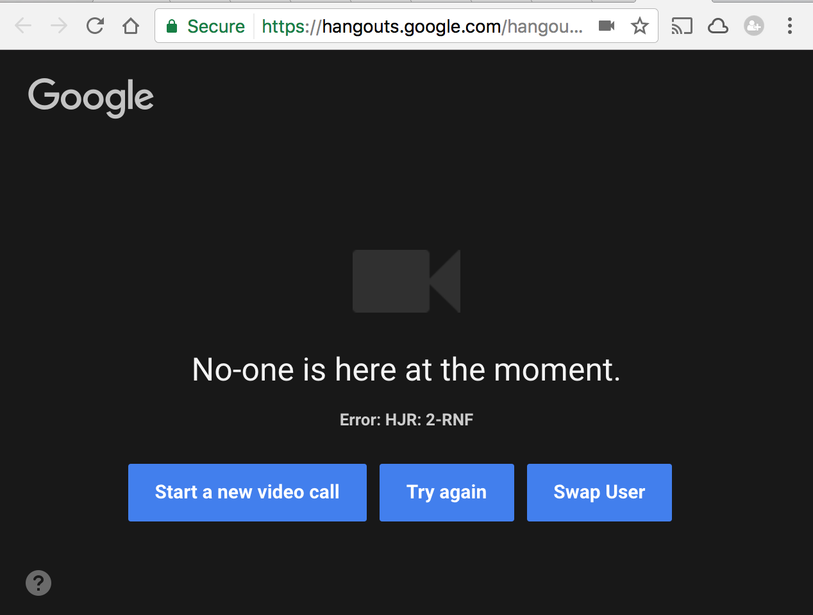

# Hangout Swap User

**Chrome Extension** that allows you to swap to your secondary Google account with no hassle.

## How to install it
### Chrome Extension
1. Build the *chrome extension* (`$ yarn` or `$ npm install`).
2. Open `chrome://chrome/extensions/`.
3. Drag and drop the folder `chrome-extension` in the browser window.

### Installation on other browsers
1. You need an extension in order to use UserScripts in your browser, here are the most popular:
  * ***Firefox***: Install [GreaseMonkey](https://addons.mozilla.org/en-US/firefox/addon/greasemonkey/).
  * ***Safari***: Install [NinjaKit](http://d.hatena.ne.jp/os0x/20100612/1276330696).
  * ***IE***: Install [Trixie](http://www.bhelpuri.net/Trixie/).
  * ***Opera***: Follow instructions located on Opera's site: [User JS](http://www.opera.com/docs/userjs/).

2. Install the user script simply clicking here: [Hangout Swap User](https://github.com/sirLisko/hangout-swap-user/raw/master/hangoutSwap.user.js`).

## In action

## Note
This project is only a **working** draft, I am not responsible of the poor quality of the code :)